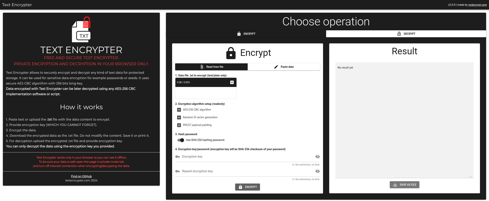

# Text Encrypter (text-encrypter)

Universal text data encryption/decryption tool using AES-256 (CBC) algorithm.
Live version: https://textencrypter.com



Features:
- .txt data file / input data encryption
- optional SHA-256 checksum of password
- save result as JSON (.txt file)
- .txt data file / input data decryption

Encryption specification:
- AES-256 CBC
- 16 bytes IV vector random generated from ASCII characters
- PKCS7 encryption payload padding

Dependencies:
- Quasar framework 2, Vue 3
- aes-js
- js-sha256
- file-saver

Tool works offline.

## Install the dependencies
```bash
nvm use
npm install
```

### Start the app in development mode (hot-code reloading, error reporting, etc.)
```bash
npm run dev
```

### Build the app for production
```bash
npm run build
```

### Customize the configuration
See [Configuring quasar.conf.js](https://quasar.dev/quasar-cli/quasar-conf-js).
